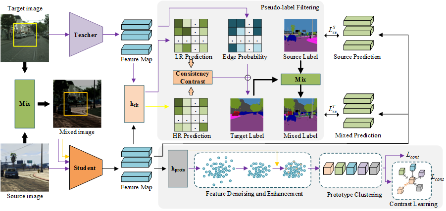
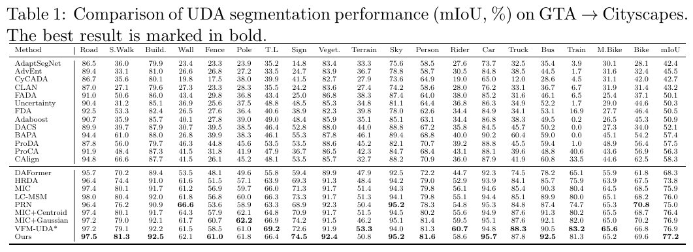
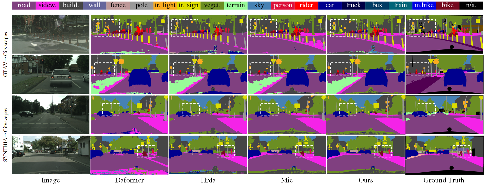

# Towards Robust UDA Semantic Segmentation with Finer Prototype Construction and Pseudo-Label Filtering

## Brief
This is the implementation of paper: Towards Robust UDA Semantic Segmentation with Finer Prototype Construction and Pseudo-Label Filtering

## Overview Framework



## Dependency and Installation
Ubuntu 20.04
Python 3.8.5
Cuda version 11.0.3

1. Create Conda Environment

```shell
conda create --name pcpr python=3.8.5
conda activate pcpr
```

2. The requirements can be installed with:

```shell
pip install -r requirements.txt 
pip install mmcv-full==1.3.7  # requires the other packages to be installed first
```

3. Please, download the MiT-B5 ImageNet weights provided by [SegFormer](https://github.com/NVlabs/SegFormer?tab=readme-ov-file#training)
from their [OneDrive](https://connecthkuhk-my.sharepoint.com/:f:/g/personal/xieenze_connect_hku_hk/EvOn3l1WyM5JpnMQFSEO5b8B7vrHw9kDaJGII-3N9KNhrg?e=cpydzZ) and put them in the folder `pretrained/`.

## Dataset Setup

**Cityscapes:** Please, download leftImg8bit_trainvaltest.zip and
gt_trainvaltest.zip from [here](https://www.cityscapes-dataset.com/downloads/)
and extract them to `data/cityscapes`.

**GTA:** Please, download all image and label packages from
[here](https://download.visinf.tu-darmstadt.de/data/from_games/) and extract
them to `data/gta`.

**Synthia (Optional):** Please, download SYNTHIA-RAND-CITYSCAPES from
[here](http://synthia-dataset.net/downloads/) and extract it to `data/synthia`.


## Training

```shell
python run_experiments.py --config configs/pcpr/gtaHR2csHR_pcpr.py
```

The logs and checkpoints are stored in `work_dirs/`.

## Inference
```shell
python -m tools.test ${CONFIG_FILE} ${CHECKPOINT_FILE} --show-dir ${SHOW_DIR}_HR --opacity 1 
```

## Results


## Results


## Acknowledgements

PCPR is based on the following open-source projects. We thank their
authors for making the source code publicly available.
* [MIC](https://github.com/lhoyer/MIC)
* [HRDA](https://github.com/lhoyer/HRDA)
* [DAFormer](https://github.com/lhoyer/DAFormer)
* [MMSegmentation](https://github.com/open-mmlab/mmsegmentation)
* [SegFormer](https://github.com/NVlabs/SegFormer)
* [DACS](https://github.com/vikolss/DACS)
